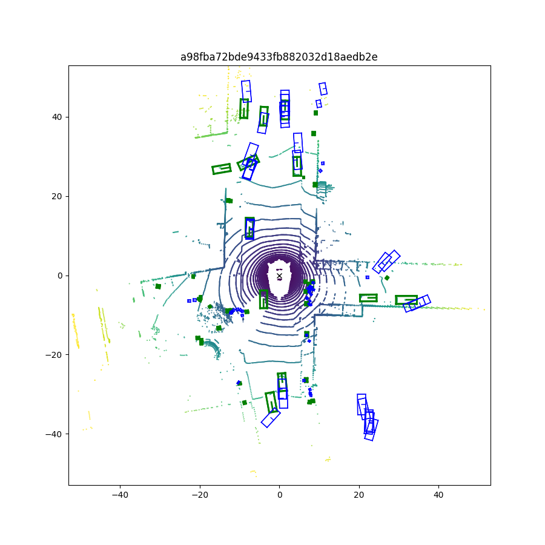

# BEVFormer (OpenMMLab 1.x)

This repo aims to re-implement BEVFormer model part from scratch, aligned with the original design.
- Config: `configs/config.py`
- Framework: MMCV 1.6.0 / MMDet 2.28.2 / MMDet3D 1.0.0rc6

## Quick Start
```bash

ENV for A100
conda create -n open-mmlab python=3.8 -y
conda activate open-mmlab

pip install torch==1.10.0+cu113 torchvision==0.11.1+cu113 torchaudio==0.10.0 -f https://download.pytorch.org/whl/cu113/torch_stable.html

pip install -U openmim
mim install mmcv-full==1.6.0 -f https://download.openmmlab.com/mmcv/dist/cu113/torch1.10/index.html

pip install mmdet==2.28.2
pip install mmsegmentation==0.30.0

pip install mmdet==2.28.2 mmsegmentation==0.30.0 mmdet3d==1.0.0rc6


pip install einops fvcore "iopath==0.1.9" "timm==0.6.13"   "typing-extensions>=4.13.0" ipython==8.12   numpy==1.23.5 "numba==0.53.0" pandas==1.5.3   "scikit-image==0.19.3" matplotlib==3.5.3 seaborn==0.12.2

pip install "setuptools==59.5.0" 

python -m pip install 'git+https://github.com/facebookresearch/detectron2.git'

export PYTHONPATH=$PYTHONPATH:"./"

python tools/create_data.py nuscenes --root-path ./data/nuscenes --out-dir ./data/nuscenes --extra-tag nuscenes --version v1.0-mini --canbus ./data

python tools/train.py configs/config.py
CUDA_VISIBLE_DEVICES=0,1 torchrun --nproc_per_node=2 --master_port=29500 tools/train.py configs/config.py --launcher pytorch

python tools/eval.py configs/config.py work_dirs/xxx/epoch_X.pth --eval bbox

ENV for H800(sm90)
# Similar setup as A100, but may require different CUDA version for sm_90 architecture
```

## Implementation Details

### Memory Consumption

This implementation consumes more GPU memory compared to the original BEVFormer, primarily due to the following reasons:

1. **Pure PyTorch Implementation without CUDA Extensions**
   - Multi-Scale Deformable Attention is implemented in pure PyTorch using `grid_sample` for bilinear interpolation
   - While the pure PyTorch implementation is more portable, it consumes more memory and runs slower compared to CUDA kernel implementations

2. **FP16 Mixed Precision Training Not Enabled**
   - Although we built FP16 support (`@auto_fp16` decorators), it is disabled by default (`fp16_enabled = False`)
   - All computations use FP32 precision, which approximately doubles memory consumption compared to FP16 training

3. **Actual Memory Usage**
   - **A100 (40GB)**: Can only run with BEV size of 120×120
   - **H800 (80GB)**: Requires approximately 55512MiB (~54GB) memory to run with BEV size of 200×200

### Training 

1. **V1.0-mini**
   - Due to the small dataset size, model performance is significantly worse compared to training on the full dataset
   （blue is the prediction result, green is the groundtruth）
   
   


2. **V1.0-trainval**
   - The original paper trains for 24 epochs on the full dataset
   - Limited by computational resources, this implementation can train for at most 8 epochs


